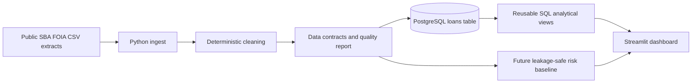

# SBA Capital Watch — Case Study

## Executive summary

SBA Capital Watch turns large public SBA 7(a) and 504 FOIA loan extracts into a reproducible analytical system. The project combines Python data preparation, explicit data-quality contracts, PostgreSQL analytical views, and an interactive Streamlit dashboard.

The current implementation reports 467,294 cleaned loan records and supports analysis by state, industry, loan status, program, lender, funding volume, jobs supported, and charge-off stress.

## Problem

Public lending data is valuable but difficult to review directly:

- 7(a) and 504 extracts can use different columns and lender fields.
- Currency, percentage, date, and category values require normalization.
- Large CSV files are awkward to explore repeatedly in a spreadsheet.
- Dashboard findings are not trustworthy unless cleaning and aggregate logic can be reproduced.
- Risk-oriented analysis can accidentally include outcome information that would leak the answer into a predictive model.

The objective was to build a system that a reviewer could inspect from raw data through final visualization rather than presenting an isolated notebook or unsupported chart.

## Architecture

## Pipeline

1. `src/ingest.py` discovers and inspects public source files.
2. `src/clean.py` standardizes column names, trims text, removes duplicates, parses dates and numeric values, and normalizes core categories.
3. `src/contracts.py` defines required analytical fields, ranges, allowed program labels, and state-format expectations.
4. `src/quality.py` produces a JSON report covering schema, null rates, duplicates, invalid relationships, category distributions, and a deterministic dataset fingerprint.
5. `src/load.py` loads cleaned records into PostgreSQL in chunks.
6. `src/transform.py` creates reusable SQL views.
7. `app/streamlit_app.py` queries PostgreSQL and presents filtered analytical views.

## Engineering decisions

### PostgreSQL instead of a notebook-only workflow

A database-backed design makes repeated filtering and aggregation practical and demonstrates a production-style separation between data preparation, storage, query logic, and presentation.

### Reusable SQL views

Common business questions are represented as named views rather than duplicated dashboard queries. This keeps state, industry, status, and jobs-per-dollar calculations inspectable and reusable.

### Explicit data contracts

The data-quality layer treats assumptions as executable rules. Required fields, numeric bounds, program categories, state formats, duplicate detection, and financial/date relationships are reported in a machine-readable format.

### Public synthetic fixture

The repository includes a small synthetic fixture representing both 7(a) and 504 records. It exercises currency parsing, percentage parsing, whitespace cleanup, duplicate removal, optional values, program aliases, and state normalization without requiring the full FOIA extracts or a private database.

### Privacy-conscious presentation

The recruiter-facing experience focuses on aggregates. It should not expose borrower contact information or present individual loan scores as underwriting recommendations.

## Current analytical findings

The current dashboard reports the following results from the combined cleaned dataset:

- California leads total SBA funding at approximately $38.82 billion, followed by Texas and Florida.
- Hotels and motels represent the largest industry by funded dollars in the analyzed data.
- Accommodation and Food Services shows the highest reported broad-sector charge-off rate by funded dollars among sectors meeting the project’s minimum-volume threshold.

These values should remain in the public README only while they can be reproduced from the current database snapshot or generated artifacts.

## Validation strategy

The data-quality foundation covers:

- Raw-column alias normalization
- Currency, comma, and percentage parsing
- Date conversion
- Exact duplicate removal
- 7(a) and 504 program normalization
- State-code normalization
- Required-column checks
- Null-rate thresholds
- Negative or implausible numeric values
- Charge-off amounts exceeding original loan amounts
- Disbursement or charge-off dates preceding approval
- Stable JSON output and dataset fingerprints

## Predictive-model plan

The next analytical release will build a charge-off risk baseline using only fields available at approval time.

Planned safeguards:

- Temporal train, validation, and test splits
- Explicit exclusion of charge-off amount, charge-off date, paid-in-full date, and post-outcome status fields
- Regularized logistic regression as an interpretable baseline
- Comparison with one tree-based model
- ROC-AUC, PR-AUC, Brier score, calibration, and threshold analysis
- A model card describing intended use, limitations, bias risks, and non-use for real lending decisions

## Limitations

- Public FOIA extracts may contain missing, delayed, or revised records.
- Reported charge-off patterns are descriptive and do not establish causation.
- Aggregate findings depend on the source-data snapshot and filtering rules.
- `jobs_supported` is a reported field and should not automatically be interpreted as independently verified job creation.
- The planned predictive baseline will be educational portfolio work, not a production underwriting system.
- Dashboard availability depends on the hosted database and Streamlit deployment.

## Recruiter walkthrough

A two-minute review should follow this order:

1. Open the live dashboard and inspect the dataset scope.
2. Change state, year, program, and industry filters.
3. Review the charge-off stress and lender/industry aggregates.
4. Inspect `src/clean.py`, `src/contracts.py`, and `src/quality.py`.
5. Run `python scripts/run_sample_pipeline.py` to generate local evidence without the production database.
6. Review the JSON quality report and the roadmap for the predictive baseline.
